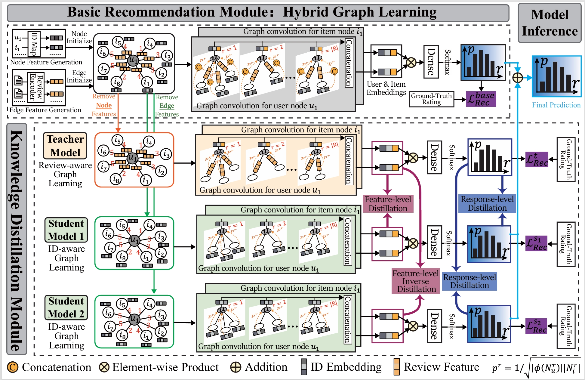

# BiKD2: Bidirectional Knowledge Distillation-enhaned Explicit Graph Disentangling Network for Reivew-based Recommendation

Paper link: XXXX

Reviews, serving as textual vessels for expressing subjective user preferences and actual item attributes, are pivotal in review-based recommender systems. However, prior research has overlooked the fact that reviews contain a significant portion of content irrelevant to user interests (referred to as review noise). This oversight allows review noise to propagate unhindered through the information processing pipeline of existing methodologies, resulting in contaminated representations. Notably, this issue will be exacerbated in graph methods where message propagate more frequently.

To fill this gap,  this paper proposes a Bidirectional Knowledge Distillation-enhanced explicit graph Disentangling network (BiKD2) for review-based recommendation. First, an explicit disentanglement-based graph convolution network is developed as a representation generator to block the cross-rating propagation of review noise. Next, a bidirectional distillation strategy is proposed to transfer preference-related pure knowledge from reviews, where the opposite distillation optimization direction aims to extract finer-grained generic features and differential features. Extensive experiments demonstrate the superiority of the proposed BiKD2 and the effectiveness of its individual components.  

We provide pytorch implementation for BiKD2. 

## prerequisites
torch=2.3.1+cu118

dgl=1.1.2+cu118
